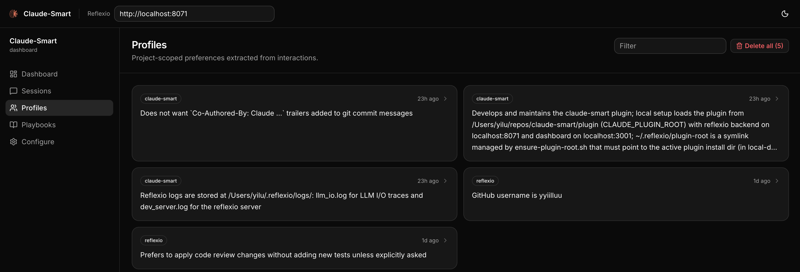
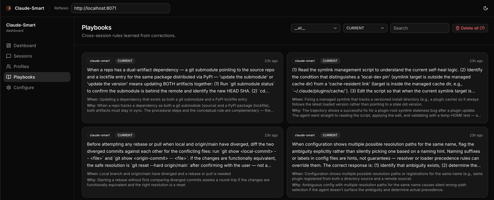

<p align="center">
  
</p>

<h1 align="center">
  claude-smart
</h1>

<h4 align="center">The <a href="https://claude.com/claude-code" target="_blank">Claude Code</a> plugin that makes Claude Code self-improve as you use it — so Claude Code stops repeating mistakes and gets better every session.</h4>

<p align="center">
  <a href="LICENSE">
    
  </a>
  <a href="plugin/pyproject.toml">
    
  </a>
  <a href="plugin/pyproject.toml">
    
  </a>
  <a href="package.json">
    
  </a>
  <a href="#quick-start">
    
  </a>
  <a href="https://discord.gg/Jbft3jPn">
    
  </a>
</p>

<p align="center">
  <a href="#quick-start">Quick Start</a> •
  <a href="#how-it-works">How It Works</a> •
  <a href="#slash-commands">Slash Commands</a> •
  <a href="#dashboard">Dashboard</a> •
  <a href="#configuration">Configuration</a> •
  <a href="TROUBLESHOOTING.md">Troubleshooting</a> •
  <a href="#license">License</a>
</p>

<p align="center">
  It learns both corrections and successful execution patterns—so Claude Code avoids repeating mistakes and reuses what works. Playbook rules travel with you across every project; per-project profiles capture how you like to work on each repo.
</p>

<p align="center">
  <b>vs <code>claude-mem</code>:</b> ~3× better at turning your corrections into rules Claude follows, ~50% more of what you tell Claude sticks. <a href="EXPERIMENT.md"><b>Read the benchmark →</b></a>
</p>

---

## Why Learning, Not Memory

Most memory solutions are still mostly informative—Claude remembers what happened, without necessarily changing what it does next.

`claude-smart` focuses on learning instead.

Four ways this changes what Claude Code can do for you:

- 💡 **Stop repeating the same mistakes:** Produces actionable playbooks Claude can follow next time; memory only records what happened.

  > *Example:* a deploy fails after Claude bumps `prisma` from 5.x to 6.0; you tell it to roll back because 6.0 breaks nested writes in your order flow.<br>
  > **Memory:** “deploy broke after prisma bump; user rolled back”<br>
  > **Learning:** “treat major-version bumps of ORMs/DB drivers as breaking — verify with integration tests, not just unit tests”

- 🚀 **Start from the optimized path:** Preserves and optimizes execution paths so Claude can reuse what already works.
  > *Example:* Claude spends several iterations trying to start the local dev environment before discovering that this repo requires `pnpm dev:all` instead of the usual `npm run dev`.<br>
  > **Memory:** “user mentioned that `npm run dev` did not work”<br>
  > **Learning:** “for this repo, always use `pnpm dev:all` to start the full local stack — `npm run dev` only starts the frontend and causes missing service errors”

  Instead of re-exploring, Claude starts from the proven path—reducing planning steps, latency, and token usage.

- 🌐 **Global playbook, project-scoped profiles:** Session memory disappears with the conversation. The playbook persists *globally* — rules learned in one repo are available in every repo you work in — while user profiles stay scoped to the current project so per-repo preferences don't leak across projects.

- 🪶 **Better context without prompt bloat:** Distilled, deduplicated playbooks stay in dozens of tokens—not thousands—even as the project grows.

---

## Quick Start

```bash
claude plugin marketplace add ReflexioAI/claude-smart
claude plugin install claude-smart@reflexioai
```

The plugin Setup hook installs its own `uv`, Python 3.12 environment, and
private Node.js/npm runtime under `~/.claude-smart/` when they are missing, so
you do not need to install Python or Node globally for the plugin/dashboard.

If you already have Node.js or uv, these convenience wrappers are equivalent
but require their own runtime to already exist:

```bash
npx claude-smart install     # or: uvx claude-smart install
```

Then restart Claude Code.

To uninstall:

```bash
claude plugin uninstall claude-smart@reflexioai
```

Or, if you already have Node.js or uv:

```bash
npx claude-smart uninstall     # or: uvx claude-smart uninstall
```

Local data under `~/.reflexio/` and `~/.claude-smart/` is left in place — remove manually if desired.

Developing the plugin itself? See [DEVELOPER.md](./DEVELOPER.md#developing-locally).
> **Not supported:** Claude Code Cowork and claude.ai/code web — they run in a remote sandbox, so the local backend/dashboard and `~/.reflexio/` aren't reachable.

---

## Key Features

- 🧠 **Learn, don't just remember** — Corrections become structured, deduplicated rules, not transcript replays.
- ⚡ **Fully automatic learning** — Every user turn, tool call, and assistant response is captured via lifecycle hooks and extracted into rules without you running anything.
- 📈 **Continuously self-tuning, not just append-on-conflict** — Existing rules are continuously refined, not just appended to. Wording gets clearer, *when-to-apply* triggers tighten or broaden as evidence accumulates, near-duplicates merge, stale rules are superseded, and dead ones are archived. The library gets sharper, not just bigger.
  > *e.g.* correct the same `npm test --run` gotcha twice → consolidated into one rule. New evidence shows it applies to `vitest` too → scope broadened. Switch policy to `pnpm test` → old rule archived, new one supersedes it.
- 🔌 **No external API call** — semantic search runs on an in-process ONNX embedder (all-MiniLM-L6-v2), and all data (profiles, playbooks, interaction buffers) is stored locally on your machine (`~/.reflexio/` and `~/.claude-smart/`).
- 🔎 **Hybrid search** — Playbooks and profiles are indexed with vector + BM25 search for fast, robust retrieval.
- 🧪 **Offline resilience** — If the reflexio backend is down, hooks buffer to disk; the next successful publish drains them.
- 🧰 **Manual correction marker** — `/claude-smart:learn` flags the last turn as a correction so the extractor weights it heavily.

---

## Dashboard

A web UI for browsing session histories, inspecting user profiles, and editing playbook rules. The dashboard auto-starts alongside the backend, so you can open **http://localhost:3001** directly. Or run `/claude-smart:dashboard` in Claude Code to launch dashboard in browser.

<p align="center">
  
  
</p>

---

## How It Works

claude-smart builds two artifacts as you work and injects them into Claude at the start of every new session:

- **User profile** (project-scoped) — preferences about how you work in this specific repo (stack, role, small quirks). *e.g.* "uses pnpm, not npm"; "prefers terse answers"; "backend engineer — explain frontend with backend analogues."
- **Playbook** (global, cross-project) — durable, generalized rules accumulated across every session, shared across every project you use claude-smart in. Each rule says when it applies and why, so a rule learned in one repo only fires in the contexts where it's relevant. *e.g.* "always pass `--run` to `npm test` — watch mode hangs CI"; "use real Postgres for integration tests — mocks once hid a broken migration."

Playbooks clean themselves up: correct the same thing twice and they merge; change your mind and the old one is archived.

Under the hood: hooks watch your turns, tool calls, and Claude's replies, auto-flagging corrections (or anything you flag with `/learn`). At session end (or on `/learn`), [reflexio](https://github.com/ReflexioAI/reflexio) — the self-improving engine that powers claude-smart — extracts profile entries and playbook rules. Next session, both get injected into the system prompt — run `/show` to see what Claude is being told. Everything runs on your machine.

**Citations (`cs-cite`).** At the end of a reply, Claude may run:

```
⏺ Bash(cs-cite r1-252,p1-5aed)
  ⎿  (No output)

⏺ ✨ 2 claude-smart learnings applied
```

That signals a profile entry (`p…`) or playbook rule (`r…`) materially shaped the reply. Open the interaction's detail page in the [dashboard](#dashboard) to see the exact cited item.

See [ARCHITECTURE.md](./ARCHITECTURE.md) for hooks, data flow, and reflexio details.

---

## Slash Commands

| Command | What it does |
| --- | --- |
| `/dashboard` | Open the dashboard in your browser, auto-starting the reflexio backend and dashboard services if they aren't already running. |
| `/show` | Print the current (global) playbook plus the current project's user profiles (same markdown that `SessionStart` injects). Use it to audit what playbooks and preferences Claude is being told to follow. |
| `/learn [note]` | Flag the most recent turn as a correction (for cases the automatic heuristic missed) and force reflexio to run extraction *now* on the session's unpublished interactions. The optional note becomes the correction description the extractor sees. |
| `/restart` | Restart the reflexio backend and dashboard to pick up new changes (e.g. after upgrading the plugin or editing local reflexio code). |
| `/clear-all` | **Destructive.** Delete *all* reflexio interactions, profiles, and user playbooks. Use when you want to wipe learned state and start fresh. |

---

## Configuration

Advanced users can tune claude-smart via environment variables — see [DEVELOPER.md](./DEVELOPER.md#environment-variables) for the full list.

### Where data lives

| Path | What |
| --- | --- |
| `~/.reflexio/data/reflexio.db` | Source of truth — profiles, user_playbooks, interactions, FTS5 indexes, and vec0 embedding tables (plus `.db-shm` / `.db-wal` WAL sidecars). Inspect with `sqlite3`. |
| `~/.reflexio/.env` | Provider config — `CLAUDE_SMART_USE_LOCAL_CLI`, `CLAUDE_SMART_USE_LOCAL_EMBEDDING`, any optional API keys. |
| `~/.reflexio/plugin-root` | Self-healed symlink to the active plugin dir (managed by `ensure-plugin-root.sh` — written on install, refreshed each `SessionStart`). Slash commands resolve through it, so don't delete it; if you do, the next session will recreate it. |
| `~/.claude-smart/sessions/{session_id}.jsonl` | Per-session buffer. User turns, assistant turns, tool invocations, `{"published_up_to": N}` watermarks. Safe to inspect and safe to delete — everything past the latest watermark has already been written to reflexio's DB. |
| `~/.cache/chroma/onnx_models/all-MiniLM-L6-v2/` | Cached ONNX weights (~86 MB, downloaded once). Delete to force a re-download. |

For troubleshooting, see [TROUBLESHOOTING.md](./TROUBLESHOOTING.md).

---

## License

This project is licensed under the **Apache License 2.0**. The bundled `reflexio/` submodule is also Apache 2.0. Claude Code is Anthropic's and not covered by this license.

See the [LICENSE](LICENSE) file for details.

---

## Support

- **Issues**: open one on GitHub describing the symptom and include the reflexio backend log (`~/.claude-smart/backend.log`) and the relevant lines of `~/.claude-smart/sessions/{session_id}.jsonl`.

---

**Built on** [reflexio](https://github.com/ReflexioAI/reflexio) · **Runs on** [Claude Code](https://claude.com/claude-code) · **Written in** Python 3.12+
